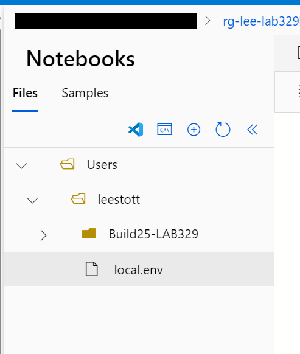

# Model Distillation Lab Manual

## Teaching Small Models to Be Smart

## Workshop Duration and Timing
- **Total Workshop Time**: 70 minutes
- **Setup Time**: 5 minutes
- **Hands-On Activities**: 60 minutes
- **Discussion Time**: 5 minutes

## Workshop Overview

Welcome to the Model Distillation Workshop! In this hands-on session, you'll learn how to transform a large language model (DeepSeek-V3) into a smaller, equally capable model (Phi-4-mini) using knowledge distillation.

## Scenario

**Scenario: Edge AI for Education — Efficient Question Answering on Resource-Constrained Devices**

Imagine you are an AI engineer at an EdTech company. You need to deliver an intelligent question-answering assistant that runs efficiently on low-cost, resource-constrained devices like laptops or edge servers in schools, without constant cloud access. The challenge is that the best-performing language models are large and expensive to run locally.

In this workshop, you will:

- Use a large cloud model (*teacher*) to generate answers for a multiple-choice dataset (**CommonsenseQA**).
- Distill its knowledge into a smaller *student* model (**Phi-4-mini**) using knowledge distillation and fine-tuning.
- Optimize and quantize the student model with **Microsoft Olive** and **ONNX** for efficient local execution.
- Register, download, and deploy the optimized model to an edge device using **Azure AI Foundry Local**.
- Validate that the compact model answers accurately and quickly on limited hardware.

This scenario reflects real-world needs for cost-effective, private, and offline AI in education, healthcare, manufacturing, and more. By the end of the lab, you’ll have built an end-to-end workflow to distill, optimize, and deploy AI models from cloud to edge.

### What You'll Build

By the end of this workshop, you'll create a compact language model that:

- Is **75% smaller** than the original teacher model
- Runs on **standard hardware** without specialized GPUs
- Can be deployed on **edge devices** or embedded systems
- Maintains most of the **capabilities** of the larger model

### Workshop Flow

This is a **practical, code-first workshop**. You’ll complete several Jupyter notebooks that guide you step by step. Each notebook takes 5–15 minutes, includes clear instructions and should be completed in order.

## Environment Setup

Let's start by setting up your environment and cloning the code repository to your Azure Machine Learning Workspace.

### Access Azure ML Studio

Open Azure ML Studio by:

1. **Opening** your web browser
1. **Navigate** to Azure ML Studio +++https://ml.azure.com+++
2. Sign in to Azure using the credentials provided in the **Resources** tab of the Skillable VM.
3. Select **workspaces** from the left navigation pane
4. **Select** your workspace (provided by your instructor)
5. Select **Notebooks** from the left navigation pane
6. Select **Terminal** to open a terminal window

   

<!-- Let's start with the first notebook! -->

### Clone the GitHub Repo and resources to your Azure ML Studio

From the terminal, you will clone the GitHub repository and set up your environment for the lab. Follow these steps:

1. **Clone and Navigate to the Workshop**: 

      ```bash
      cd Users &&
      cd User1-* &&
      git clone https://github.com/microsoft/Build25-LAB329 &&
      cp Build25-LAB329/Lab329/Notebook/sample.env local.env &&
      cd Build25-LAB329
      ```

2. Select the **Refresh** icon in the file explorer pane to see the new `local.env` file.

      

3. Select the **local.env** file to open it in the editor.

      ```text
      TEACHER_MODEL_NAME=DeepSeek-V3
      TEACHER_MODEL_ENDPOINT=https://your-endpoint.services.ai.azure.com/models
      TEACHER_MODEL_KEY=your-api-key-here
      AZUREML_SUBSCRIPTION_ID=your-subscription-id
      AZUREML_RESOURCE_GROUP=your-resource-group
      AZUREML_WS_NAME=your-workspace-name
      ```


### Environment Variables

You'll need the following environment variables to run the notebooks:

- `AZUREML_SUBSCRIPTION_ID`: Your Azure Subscription ID. Get this from the **Resources** tab of the Skillable VM.

From the Azure Portal


<!-- We provide a `sample.env` file in the `notebooks` folder you will need to create a `local.env` file and save this to your user folder

 -->

Update the environment file using the information from the **Resources** tab of the Skillable VM. Open the `local.env` file in your favorite text editor and update the following variables:

```
TEACHER_MODEL_NAME=DeepSeek-V3
TEACHER_MODEL_ENDPOINT=https://your-endpoint.services.ai.azure.com/models
TEACHER_MODEL_KEY=your-api-key-here
AZUREML_SUBSCRIPTION_ID=your-subscription-id
AZUREML_RESOURCE_GROUP=your-resource-group
AZUREML_WS_NAME=your-workspace-name
```

Save the file in root of your your user folder as in the image above save and close the `local.env`.


1. **Navigate to the Lab Directory**: Go to the Lab329 folder containing the notebooks:
   ```bash
   cd Build-Lab329/Lab329/Notebook
   ```

## Notebook-by-Notebook Guide

This workshop uses 7 Jupyter notebooks that you'll run in sequence. Each notebook builds on the previous one, so it's important to complete them in order. We will be your Azure ML workspace Notebook environment for notebooks 1 - 4 you will then be using the Skillable VM for notebooks 5 - 7.

Let's look at each notebook and what you'll do:

| Notebook                                 | Purpose                                     | Duration |
| ---------------------------------------- | ------------------------------------------- | -------- |
| 01_AzureML_Distillation                  | Generate training data using DeepSeek-V3    | 15 min   |
| 02_AzureML_FineTuningAndConvertByMSOlive | Fine-tune Phi-4-mini with LoRA and optimize | 15 min   |
| 03_AzureML_RuningByORTGenAI              | Test model inference with ONNX Runtime      | 10 min   |
| 04_AzureML_RegisterToAzureML             | Register model to Azure ML                  | 5 min    |
| 05_Local_Download                        | Download model for local deployment         | 5 min    |
| 06_Local_Inference                       | Run inference locally                       | 10 min   |
| 07_Local_Inference                       | Run inference locally with Foundry Local    | 10 min   |

Now you’re ready to work with the repository on your Azure ML Studio +++https://ml.azure.com+++
