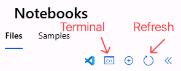

# Model Distillation Lab Manual

## Teaching Small Models to Be Smart

## Workshop Duration and Timing
- **Total Workshop Time**: 70 minutes
- **Setup Time**: 5 minutes
- **Hands-On Activities**: 60 minutes
- **Discussion Time**: 5 minutes

## Workshop Overview

Welcome to the Model Distillation Workshop! In this hands-on session, you'll learn how to transform a large language model (DeepSeek-V3) into a smaller, equally capable model (Phi-4-mini) using knowledge distillation.

## Scenario

**Scenario: Edge AI for Education — Efficient Question Answering on Resource-Constrained Devices**

Imagine you are an AI engineer at an EdTech company. You need to deliver an intelligent question-answering assistant that runs efficiently on low-cost, resource-constrained devices like laptops or edge servers in schools, without constant cloud access. The challenge is that the best-performing language models are large and expensive to run locally.

In this workshop, you will:

- Use a large cloud model (*teacher*) to generate answers for a multiple-choice dataset (**CommonsenseQA**).
- Distill its knowledge into a smaller *student* model (**Phi-4-mini**) using knowledge distillation and fine-tuning.
- Optimize and quantize the student model with **Microsoft Olive** and **ONNX** for efficient local execution.
- Register, download, and deploy the optimized model to an edge device using **Azure AI Foundry Local**.
- Validate that the compact model answers accurately and quickly on limited hardware.

This scenario reflects real-world needs for cost-effective, private, and offline AI in education, healthcare, manufacturing, and more. By the end of the lab, you’ll have built an end-to-end workflow to distill, optimize, and deploy AI models from cloud to edge.

### What You'll Build

By the end of this workshop, you'll create a compact language model that:

- Is **75% smaller** than the original teacher model
- Runs on **standard hardware** without specialized GPUs
- Can be deployed on **edge devices** or embedded systems
- Maintains most of the **capabilities** of the larger model

### Workshop Flow

This is a **practical, code-first workshop**. You’ll complete several Jupyter notebooks that guide you step by step. Each notebook takes 5–15 minutes, includes clear instructions and should be completed in order.

## Environment Setup

Let's start by setting up your environment and cloning the code repository to your Azure Machine Learning Workspace.

### Access Azure ML Studio

Open Azure ML Studio by:

1. **Opening** your web browser
1. **Navigate** to Azure ML Studio +++https://ml.azure.com+++
2. Sign in to Azure using the credentials provided in the **Resources** tab of the Skillable VM.
3. Select **workspaces** from the left navigation pane
4. **Select** your workspace (provided by your instructor)
5. Select **Notebooks** from the left navigation pane
6. Familiarize yourself with **Notebooks Menu**.

   

7. Select **Terminal** to open a terminal window

### Clone the GitHub Repo and resources to your Azure ML Studio

From the terminal, you will clone the GitHub repository and set up your environment for the lab. Follow these steps:

1. **Clone and Navigate to the Workshop**: 

      ```bash
      +++
      cd Users &&
      cd User1-* &&
      git clone https://github.com/microsoft/Build25-LAB329 &&
      touch local.env &&
      cd Build25-LAB329
      +++
      ```

2. Select the **Refresh** icon in the file explorer pane to see the `local.env` file and cloned repository.


### Open the Lab Configuration File

1. Open **File Explorer**. It's pinned to the Windows taskbar.
2. Navigate to the **C:\Users\LabUser\Desktop\lab** folder.
3. Right-click on the **local.env** file, select **Open with**, and then select **Notepad**.
4. Copy the contents of the **local.env** file to your clipboard.

### Update the ML Environment Variables

1. Switch back to the **Azure ML Studio**.
2. From the **Notebooks** menu, select the **local.env** file in the **Build25-LAB329** folder.
3. Paste the contents of the **local.env** file into the **local.env** file in Azure ML Studio.
4. Select the **Save** icon to save the changes.
5. Close the **local.env** file by selecting the **X** on the **local.env** tab.

## Open the Lab Notebooks Folder

This workshop uses 7 Jupyter notebooks in sequence. Complete them in order: use Azure ML for notebooks 1–4, then switch to the Skillable VM for notebooks 5–7.

1. From the **Notebooks** file explorer, select the **Build-Lab329** folder.
2. Select the **Lab329** folder.
3. Select the **Notebook** folder.


## Notebook-by-Notebook Guide

Let's look at each notebook and what you'll do:

Notebook 01_AzureML_Distillation  
- **Purpose:** Generate training data using DeepSeek-V3  
- **Time:** 15 min  

Notebook 02_AzureML_FineTuningAndConvertByMSOlive  
- **Purpose:** Fine-tune Phi-4-mini with LoRA and optimize  
- **Time:** 15 min  

Notebook 03_AzureML_RuningByORTGenAI  
- **Purpose:** Test model inference with ONNX Runtime  
- **Time:** 10 min  

Notebook 04_AzureML_RegisterToAzureML  
- **Purpose:** Register model to Azure ML  
- **Time:** 5 min  

Notebook 05_Local_Download  
- **Purpose:** Download model for local deployment  
- **Time:** 5 min  

Notebook 06_Local_Inference  
- **Purpose:** Run inference locally  
- **Time:** 10 min  

Notebook 07_Local_Inference  
- **Purpose:** Run inference locally with Foundry Local  
- **Time:** 10 min  
