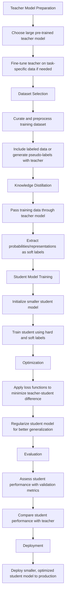
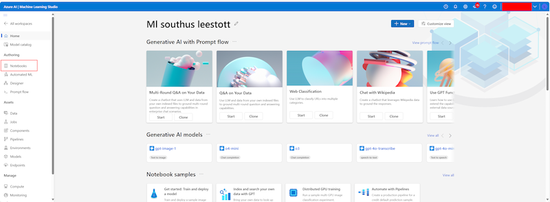
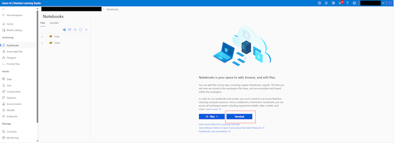
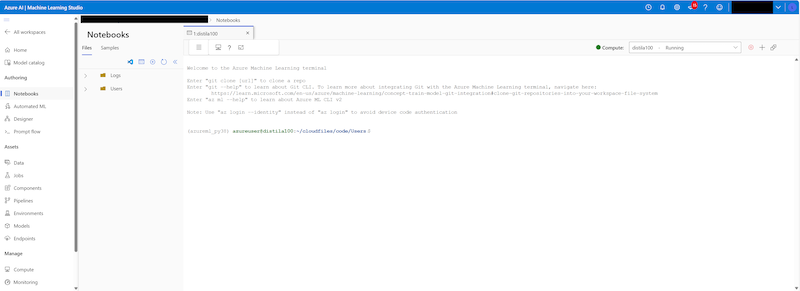

# Model Distillation Lab Manual: Teaching Small Models to Be Smart

## Duration
- Total Time: 70 minutes
- Reading Time: 20 minutes
- Hands-On Activities: 50 minutes

## Table of Contents
- [Introduction](#introduction)
- [Prerequisites](#prerequisites)
- [Lab Objectives](#lab-objectives)
- [What is Knowledge Distillation?](#what-is-knowledge-distillation)
- [Knowledge Distillation Flow Chart](#knowledge-distillation-flow-chart)
- [Clone the GitHub Repo and resources to your Local Machine](#clone-the-github-repo-and-resources-to-your-local-machine)
- [Workshop Notebook Structure](#workshop-notebook-structure)
- [Cloud-Based Distillation Using Microsoft Azure AI Foundry](#cloud-based-distillation-using-microsoft-azure-ai-foundry)
  - [Configure Your Environment (5 minutes)](#configure-your-environment-5-minutes)
  - [Step 1: Generate Training Data from a Teacher Model (15 minutes)](#step-1-generate-training-data-from-a-teacher-model-15-minutes)
  - [Step 2: Fine-tune and Optimize the Model (15 minutes)](#step-2-fine-tune-and-optimize-the-model-15-minutes)
  - [Step 3: Test Your Optimized Model (10 minutes)](#step-3-test-your-optimized-model-10-minutes)
  - [Step 4: Register Your Model to Azure ML (5 minutes)](#step-4-register-your-model-to-azure-ml-5-minutes)
  - [Step 5: Download Your Model for Local Deployment (5 minutes)](#step-5-download-your-model-for-local-deployment-5-minutes)
- [Conclusion](#conclusion)
- [Additional Resources](#additional-resources)

## Introduction

Welcome to the Model Distillation Lab! In this hands-on session, you will learn how to distill knowledge from large language models like GPT-4o into smaller, more efficient models. This technique allows you to create compact models that can run faster and with fewer resources while still maintaining much of the capability of their larger counterparts.

This lab manual provides step-by-step instructions for two distillation approaches:
1. **Cloud-based distillation** using Microsoft Azure AI Foundry (for those with Azure access)
2. **Local-based distillation** on your own machine (for everyone)

By the end of this lab, you'll understand the principles of knowledge distillation and have practical experience implementing it using Python and popular machine learning frameworks.

## Prerequisites

- Basic Python programming knowledge
- Familiarity with machine learning concepts
- A computer with internet access
- For cloud-based approach: Azure account with access to Microsoft Azure AI Foundry
- For local-based approach: Python 3.7+ installed on your machine

## Lab Objectives

- Understand the concept and benefits of model distillation
- Generate training data using a larger "teacher" model
- Train a smaller "student" model to mimic the teacher's outputs
- Evaluate the effectiveness of the distilled model
- Compare cloud-based and local distillation approaches

## What is Knowledge Distillation?

Knowledge distillation is a technique for transferring knowledge from a large, complex model (the "teacher") to a smaller, more efficient model (the "student"). Instead of training the student model directly on raw data, we train it to mimic the outputs of the teacher model.

The process works as follows:
1. A large, powerful model (like GPT-4o) generates responses to various prompts
2. These prompt-response pairs become the training data
3. A smaller model (like DistilGPT-2) is trained to produce similar outputs given the same prompts
4. The resulting student model is more efficient while preserving much of the teacher's capabilities

Distillation offers several benefits:
- Faster inference times
- Lower computational resource requirements
- Reduced deployment costs
- Possibility of on-device AI applications

## Knowledge Distillation Flow Chart



Now let's get started with the practical implementation!

## Clone the GitHub Repo and resources to your Azure ML Studio 

Open your [Azure ML Studio](https://ml.azure.com)



Select Notebooks



Select Terminal




To clone a repository, you can follow these steps:
   ```
1. **Clone the Repository**: Use the `git clone` command followed by the repository URL:
   ```
   git clone https://github.com/microsoft/Build25-LAB329 
   ```

2. **Access the Cloned Repository**: After cloning, navigate to the directory of the cloned repository:
   ```
   cd repository
   ```

Login with your azure creditional 

```
az login --identity
```

Now you’re ready to work with the repository on your Azure ML Studio!


## Workshop Notebook Structure

This lab uses a series of Jupyter notebooks that guide you through the complete model distillation workflow. Each notebook focuses on a specific phase of the process:

1. [**`01.AzureML_Distillation.ipynb`**](../Lab329/Notebook/01.AzureML_Distillation.ipynb): Initial knowledge distillation using a teacher model
2. [**`02.AzureML_FineTuningAndConvertByMSOlive.ipynb`**](../Lab329/Notebook/02.AzureML_FineTuningAndConvertByMSOlive.ipynb): Fine-tuning and model optimization
3. [**`03.AzureML_RuningByORTGenAI.ipynb`**](../Lab329/Notebook/03.AzureML_RuningByORTGenAI.ipynb): Model inference using ONNX Runtime
4. [**`04.AzureML_RegisterToAzureML.ipynb`**](../Lab329/Notebook/04.AzureML_RegisterToAzureML.ipynb): Model registration to Azure ML
5. [**`05.Local_Download.ipynb`**](../Lab329/Notebook/05.Local_Download.ipynb): Downloading models for local deployment

Each notebook includes a corresponding overview document (XX.Overview.md) that explains the concepts and techniques used.


## Cloud-Based Distillation Using Microsoft Azure AI Foundry

Microsoft Azure AI Foundry provides a managed environment for large-scale machine learning tasks. This approach is ideal for distilling larger models or when you need substantial compute resources.

### Configure Your Environment (5 minutes)

1. Create a `Local.env` file based on the `sample.env` template in the Notebook folder
2. Update the Azure configuration settings with your credentials:

```
TEACHER_MODEL_NAME=your-model-name
TEACHER_MODEL_ENDPOINT=https://your-endpoint.services.ai.azure.com/models
TEACHER_MODEL_KEY=your-api-key-here

# Azure ML workspace information
AZUREML_SUBSCRIPTION_ID=your-subscription-id
AZUREML_RESOURCE_GROUP=your-resource-group
AZUREML_WS_NAME=your-workspace-name
```


### Step 1: Generate Training Data from a Teacher Model (15 minutes)

Work through the [`01.AzureML_Distillation.ipynb`](../Lab329/Notebook/01.AzureML_Distillation.ipynb) notebook to generate training data for your student model:

1. **Install required packages**:
   ```python
   pip install python-dotenv
   pip install datasets -U
   pip install azure-ai-inference
   ```

2. **Load and prepare a dataset**:
   ```python
   from datasets import load_dataset
   from abc import ABC
   
   # Define a class to handle the input dataset
   class InputDataset(ABC):
       def __init__(self):
           super().__init__()
           (
               self.train_data_file_name,
               self.test_data_file_name,
               self.eval_data_file_name,
           ) = (None, None, None)
   
   # Specific implementation for the QA dataset
   class CQnAHuggingFaceInputDataset(InputDataset):
       def __init__(self):
           super().__init__()
   
       def load_hf_dataset(
           self,
           dataset_name,
           train_sample_size=10,
           val_sample_size=10,
           test_sample_size=10,
           train_split_name="train",
           val_split_name="validation",
           test_split_name="test",
       ):
           # Load dataset and create splits
           full_dataset = load_dataset(dataset_name)
           train_data = full_dataset[train_split_name].select(range(train_sample_size))
           val_data = full_dataset[val_split_name].select(range(val_sample_size))
           test_data = full_dataset[test_split_name].select(range(test_sample_size))
           return train_data, val_data, test_data
   ```

3. **Sample data from a Hugging Face dataset**:
   ```python
   # Define sample sizes
   train_sample_size = 100
   val_sample_size = 100
   
   # We'll use the commonsense QA dataset
   dataset_name = "tau/commonsense_qa"
   input_dataset = CQnAHuggingFaceInputDataset()
   
   # Load the dataset
   train, val, _ = input_dataset.load_hf_dataset(
       dataset_name=dataset_name,
       train_sample_size=train_sample_size,
       val_sample_size=val_sample_size,
       train_split_name="train",
       val_split_name="validation",
   )
   ```

4. **Format the questions for the teacher model**:
   ```python
   import json
   
   # Create directory for data
   ! mkdir -p data
   train_data_path = "data/train_original_data.jsonl"
   
   # Define prompts
   system_prompt = "You are a helpful assistant. Your output should only be one of the five choices: 'A', 'B', 'C', 'D', or 'E'."
   user_prompt_template = "Answer the following multiple-choice question by selecting the correct option.\n\nQuestion: {question}\nAnswer Choices:\n{answer_choices}"
   
   # Format each question
   for row in train:
       data = {"messages": []}
       data["messages"].append(
           {
               "role": "system",
               "content": system_prompt,
           }
       )
       question, choices = row["question"], row["choices"]
       labels, choice_list = choices["label"], choices["text"]
       answer_choices = [
           "({}) {}".format(labels[i], choice_list[i]) for i in range(len(labels))
       ]
       answer_choices = "\n".join(answer_choices)
       data["messages"].append(
           {
               "role": "user",
               "content": user_prompt_template.format(
                   question=question, answer_choices=answer_choices
               ),
           }
       )
       with open(train_data_path, "a") as f:
           f.write(json.dumps(data) + "\n")
   ```

5. **Load credentials and connect to the teacher model**:
   ```python
   from dotenv import load_dotenv
   import os
   from azure.ai.inference import ChatCompletionsClient
   from azure.ai.inference.models import SystemMessage, UserMessage
   from azure.core.credentials import AzureKeyCredential
   
   # Load environment variables
   load_dotenv()
   
   teacher_model_name = os.getenv('TEACHER_MODEL_NAME')
   teacher_model_endpoint_url = os.getenv('TEACHER_MODEL_ENDPOINT')
   teacher_model_api_key = os.getenv('TEACHER_MODEL_KEY')
   
   # Set up client
   endpoint = teacher_model_endpoint_url
   model_name = teacher_model_name
   key = teacher_model_api_key
   client = ChatCompletionsClient(endpoint=endpoint, credential=AzureKeyCredential(key))
   ```

6. **Generate responses using the teacher model**:
   ```python
   def process_question(question_data):
       try:
           messages = []
           for msg in question_data["messages"]:
               if msg["role"] == "system":
                   messages.append(SystemMessage(content=msg["content"]))
               elif msg["role"] == "user":
                   messages.append(UserMessage(content=msg["content"]))
   
           response = client.complete(
               messages=messages,
               model=model_name,
               max_tokens=100  # Short answers (A, B, C, D, or E)
           )
   
           return {
               "question": question_data["messages"][1]["content"],
               "response": response.choices[0].message.content,
               "full_response": response
           }
       except Exception as e:
           return {
               "question": question_data["messages"][1]["content"] if len(question_data["messages"]) > 1 else "Error",
               "response": f"Error: {str(e)}",
               "full_response": None
           }
   
   # Process all questions
   results = []
   with open(train_data_path, 'r', encoding='utf-8') as file:
       print(f"Processing questions from {train_data_path}")
       for i, line in enumerate(file):
           if line.strip():  # Skip empty lines
               try:
                   question_data = json.loads(line)
                   print(f"Processing question {i+1}...")
                   result = process_question(question_data)
                   results.append(result)
                   print(f"Question {i+1} response: {result['response']}")
               except Exception as e:
                   print(f"Error processing line {i+1}: {str(e)}")
   ```

7. **Save the teacher's responses for student model training**:
   ```python
   output_file_path = "./data/train_data.jsonl"
   with open(output_file_path, 'w', encoding='utf-8') as f:
       for result in results:
           # Create the simplified output format
           output_line = {
               "Question": result["question"],
               "Answer": result["response"]
           }
   
           # Write as JSONL (one JSON object per line)
           f.write(json.dumps(output_line, ensure_ascii=False) + '\n')
   ```

This process:
- Loads a multiple-choice question dataset from Hugging Face
- Formats each question with a clear system prompt and instruction
- Sends the questions to your teacher model (using Azure AI Foundry MAI endpoint)
- Collects the high-quality responses from the larger model
- Creates a training dataset that pairs questions with expert answers
- Formats the output for use in the next step of model distillation

The resulting `train_data.jsonl` file will be used in Step 2 to fine-tune your smaller student model.

### Step 2: Fine-tune and Optimize the Model (15 minutes)

Work through the [`02.AzureML_FineTuningAndConvertByMSOlive.ipynb`](/Lab329/Notebook/02.AzureML_FineTuningAndConvertByMSOlive.ipynb) notebook to fine-tune and optimize the student model:

1. **Install required packages**:
   ```python
   pip install torch torchvision torchaudio --index-url https://download.pytorch.org/whl/cu124 -U
   pip install olive-ai[auto-opt] -U
   pip install onnxruntime-genai==0.7.0 --pre
   pip install peft
   ```

2. **Fine-tune with LoRA using Microsoft Olive**:
   ```python
   ! olive finetune \
       --method lora \
       --model_name_or_path azureml://registries/azureml/models/Phi-4-mini-instruct/versions/1 \
       --trust_remote_code \
       --data_name json \
       --data_files ./data/train_data.jsonl \
       --text_template "<|user|>{Question}<|end|><|assistant|>{Answer}<|end|>" \
       --max_steps 100 \
       --output_path models/phi-4-mini/ft \
       --target_modules "q_proj","k_proj","v_proj","o_proj","gate_proj","up_proj","down_proj" \
       --log_level 1
   ```

3. **Optimize the model with quantization**:
   ```python
   ! olive auto-opt \
       --model_name_or_path azureml://registries/azureml/models/Phi-4-mini-instruct/versions/1 \
       --adapter_path models/phi-4-mini/ft/adapter \
       --device cpu \
       --provider CPUExecutionProvider \
       --use_model_builder \
       --precision int4 \
       --output_path models/phi-4-mini/onnx \
       --log_level 1
   ```

This process:
- Uses Microsoft Olive's fine-tuning capability with LoRA (Low-Rank Adaptation)
- Fine-tunes the Phi-4-mini-instruct model using your generated training data
- Converts the model to ONNX format for optimized inference
- Applies int4 quantization to dramatically reduce model size

### Step 3: Test Your Optimized Model (10 minutes)

Work through the [`03.AzureML_RuningByORTGenAI.ipynb`](/Lab329/Notebook/03.AzureML_RuningByORTGenAI.ipynb) notebook to run inference with your optimized model:

1. **Load the ONNX model and adapter**:
   ```python
   import onnxruntime_genai as og
   import numpy as np
   
   model_folder = "./models/phi-4-mini/onnx/model"
   model = og.Model(model_folder)
   
   adapters = og.Adapters(model)
   adapters.load('./models/phi-4-mini/onnx/model/adapter_weights.onnx_adapter', "qa_choice")
   ```

2. **Set up the tokenizer and parameters**:
   ```python
   tokenizer = og.Tokenizer(model)
   tokenizer_stream = tokenizer.create_stream()
   
   search_options = {}
   search_options['max_length'] = 102
   search_options['past_present_share_buffer'] = False
   ```

3. **Run inference on sample questions**:
   ```python
   chat_template = "</s>You are a helpful assistant. Your output should only be one of the five choices: 'A', 'B', 'C', 'D', or 'E'.<|end|><|user|>{input}<|end|><|assistant|>"
   prompt = f'{chat_template.format(input=input)}'
   
   input_tokens = tokenizer.encode(prompt)
   params = og.GeneratorParams(model)
   params.set_search_options(**search_options)
   generator = og.Generator(model, params)
   generator.set_active_adapter(adapters, "qa_choice")
   generator.append_tokens(input_tokens)
   ```

### Step 4: Register Your Model to Azure ML (5 minutes)

Work through the [`04.AzureML_RegisterToAzureML.ipynb`](/Lab329/Notebook/04.AzureML_RegisterToAzureML.ipynb) notebook to register your optimized model to Azure Machine Learning:

1. **Set up Azure ML client**:
   ```python
   from azure.ai.ml import MLClient
   from azure.ai.ml.entities import Model
   from azure.ai.ml.constants import AssetTypes
   from azure.identity import DefaultAzureCredential
   
   subscription_id = os.getenv('AZUREML_SUBSCRIPTION_ID')
   resource_group = os.getenv('AZUREML_RESOURCE_GROUP')
   workspace = os.getenv('AZUREML_WS_NAME')
   
   ml_client = MLClient(DefaultAzureCredential(), subscription_id, resource_group, workspace)
   ```

2. **Create model entity and register it**:
   ```python
   file_model = Model(
       path="models/phi-4-mini/onnx",
       type=AssetTypes.CUSTOM_MODEL,
       name="fine-tuning-phi-4-mini-onnx-int4-cpu",
       description="Fine tuning by MSOlive",
   )
   
   ml_client.models.create_or_update(file_model)
   ```

### Step 5: Download Your Model for Local Deployment (5 minutes)

Work through the [`05.Local_Download.ipynb`](/Lab329/Notebook/05.Local_Download.ipynb) notebook to download your model for local deployment:

1. **List available models in the registry**:
   ```python
   ml_client.models.list()
   ```

2. **Download your specific model**:
   ```python
   ml_client.models.download("fine-tuning-phi-4-mini-onnx-int4-cpu", 1)
   ```

Congratulations! You've successfully:
1. Generated training data using a teacher model
2. Fine-tuned a smaller student model with Microsoft Olive and LoRA
3. Optimized the model with int4 quantization for efficient deployment
4. Tested the model using ONNX Runtime GenAI
5. Registered and downloaded your model for deployment

This end-to-end workflow demonstrates the power of model distillation and optimization using Microsoft Azure AI Foundry and related tools.

## Conclusion

In this lab, you've learned:
- The fundamentals of knowledge distillation
- How to generate training data using a teacher model
- How to train a student model to mimic the teacher
- How to evaluate your distilled model
- The trade-offs between model size and performance

Knowledge distillation is a powerful technique for creating more efficient models while preserving much of the capability of larger models. This approach enables broader deployment of advanced AI capabilities across devices and environments with limited resources.

## Additional Resources

- [Knowledge Distillation in NLP (Blog Post)](https://towardsdatascience.com/knowledge-distillation-in-natural-language-processing-9f758493cfff)
- [Hugging Face Transformers Documentation](https://huggingface.co/docs/transformers/index)
- [Microsoft Azure AI Foundry Documentation](https://learn.microsoft.com/en-us/azure/machine-learning/)
- [OpenAI API Documentation](https://platform.openai.com/docs/api-reference)
- [DistilBERT Paper: Smaller, faster, cheaper, lighter Transformer models](https://arxiv.org/abs/1910.01108)

If you encounter any issues during the lab, please consult the project README or ask your instructor for assistance.
