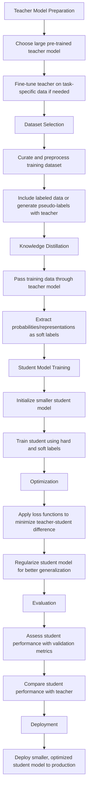

# Model Distillation Lab Manual: Teaching Small Models to Be Smart

## Duration
- Total Time: 70 minutes
- Reading Time: 20 minutes
- Hands-On Activities: 50 minutes

## Table of Contents
- [Introduction](#introduction)
- [Prerequisites](#prerequisites)
- [Lab Objectives](#lab-objectives)
- [What is Knowledge Distillation?](#what-is-knowledge-distillation)
- [Knowledge Distillation Flow Chart](#knowledge-distillation-flow-chart)
- [Option 1: Cloud-Based Distillation Using Azure AI Foundry](#option-1-cloud-based-distillation-using-azure-ai-foundry)
- [Option 2: Local-Based Distillation](#option-2-local-based-distillation)
- [Evaluating Your Distilled Model](#evaluating-your-distilled-model)
- [Conclusion](#conclusion)
- [Additional Resources](#additional-resources)

## Introduction

Welcome to the Model Distillation Lab! In this hands-on session, you will learn how to distill knowledge from large language models like GPT-4o into smaller, more efficient models. This technique allows you to create compact models that can run faster and with fewer resources while still maintaining much of the capability of their larger counterparts.

This lab manual provides step-by-step instructions for two distillation approaches:
1. **Cloud-based distillation** using Azure AI Foundry (for those with Azure access)
2. **Local-based distillation** on your own machine (for everyone)

By the end of this lab, you'll understand the principles of knowledge distillation and have practical experience implementing it using Python and popular machine learning frameworks.

## Prerequisites

- Basic Python programming knowledge
- Familiarity with machine learning concepts
- A computer with internet access
- For cloud-based approach: Azure account with access to Azure AI Foundry
- For local-based approach: Python 3.7+ installed on your machine

## Lab Objectives

- Understand the concept and benefits of model distillation
- Generate training data using a larger "teacher" model
- Train a smaller "student" model to mimic the teacher's outputs
- Evaluate the effectiveness of the distilled model
- Compare cloud-based and local distillation approaches

## What is Knowledge Distillation?

Knowledge distillation is a technique for transferring knowledge from a large, complex model (the "teacher") to a smaller, more efficient model (the "student"). Instead of training the student model directly on raw data, we train it to mimic the outputs of the teacher model.

The process works as follows:
1. A large, powerful model (like GPT-4o) generates responses to various prompts
2. These prompt-response pairs become the training data
3. A smaller model (like DistilGPT-2) is trained to produce similar outputs given the same prompts
4. The resulting student model is more efficient while preserving much of the teacher's capabilities

Distillation offers several benefits:
- Faster inference times
- Lower computational resource requirements
- Reduced deployment costs
- Possibility of on-device AI applications

## Knowledge Distillation Flow Chart



Now let's get started with the practical implementation!

## Clone the GitHub Repo and resources to your Local Machine 

To clone a repository, you can follow these steps:

1. **Install Git**: If Git is not already installed on your machine, download and install it from [git-scm.com](https://git-scm.com/).

2. **Get the Repository URL**: Clone the repository `https://github.com/microsoft/Build25-LAB329`.

3. **Open a Terminal or Command Prompt**: On Windows, use Command Prompt, PowerShell, or a Git Bash terminal. On macOS or Linux, use a terminal.

4. **Navigate to Your Desired Folder**: Use the `cd` command to move into the directory where you want the repository to be cloned:
   ```
   cd path/to/your/folder
   ```

5. **Clone the Repository**: Use the `git clone` command followed by the repository URL:
   ```
   git clone https://github.com/microsoft/Build25-LAB329 
   ```

6. **Access the Cloned Repository**: After cloning, navigate to the directory of the cloned repository:
   ```
   cd repository
   ```

Now you’re ready to work with the repository on your local machine!

## Option 1: Cloud-Based Distillation Using Azure AI Foundry

Azure AI Foundry provides a managed environment for large-scale machine learning tasks. This approach is ideal for distilling larger models or when you need substantial compute resources.

### Step 1: Configure Your Environment (5 minutes)

1. Open the `config/config.py` file in your project
2. Update the Azure configuration settings with your credentials:

```python
# Azure AI Foundry Configuration
AZURE_ML_SUBSCRIPTION_ID = "your-subscription-id"
AZURE_ML_RESOURCE_GROUP = "your-resource-group"
AZURE_ML_WORKSPACE_NAME = "your-workspace-name"

# Azure OpenAI Configuration
AZURE_OPENAI_ENDPOINT = "https://your-endpoint.openai.azure.com/"
AZURE_OPENAI_API_KEY = "your-api-key"
AZURE_OPENAI_API_VERSION = "2023-12-01-preview"
AZURE_OPENAI_DEPLOYMENT_NAME = "gpt-4o"  # Your GPT-4o deployment name
```

3. Install the required dependencies:

```bash
pip install -r requirements.txt
```

### Step 2: Generate Training Data (10 minutes)

The first step in distillation is generating training examples using the teacher model (GPT-4o):

```bash
python src/distill_gpt4o.py --num_examples 50 --student_model distilgpt2
```

This script:
- Creates 50 sample prompts
- Sends each prompt to the GPT-4o model
- Captures the responses
- Saves the prompt-response pairs as training data
- Registers the dataset in your Azure ML workspace

You can adjust the number of examples based on your time constraints. For this lab, we recommend 50-100 examples.

### Step 3: Launch the Distillation Job (5 minutes)

The script from Step 2 automatically launches a distillation training job in Azure AI Foundry after generating the data. You'll see output like:

```
Distillation job created with ID: job-123456-789
You can monitor the job in the Azure AI Foundry portal.
```

### Step 4: Monitor Training Progress (20 minutes)

1. Navigate to the Azure AI Foundry portal
2. Go to your workspace
3. Select "Jobs" in the left navigation
4. Find and click on your distillation job
5. Monitor the training progress, including:
   - Loss metrics
   - Resource utilization
   - Job status

While the job runs, take some time to review the `distillation_train.py` script to understand the training process.

### Step 5: Access Your Distilled Model (10 minutes)

Once training completes:

1. In the Azure AI Foundry portal, navigate to "Models"
2. Find your newly registered model (default name: "DistilledModel")
3. You can now:
   - Download the model for local use
   - Deploy it as an endpoint
   - Use it in other Azure ML pipelines

Congratulations! You've successfully distilled knowledge from GPT-4o into a smaller model using Azure AI Foundry.

## Option 2: Local-Based Distillation

Don't have Azure access? No problem! This approach allows you to perform distillation on your local machine.

### Step 1: Configure Your Environment (5 minutes)

1. Install the required dependencies:

```bash
pip install -r requirements.txt
```

2. Ensure you have an OpenAI API key for accessing GPT-4o
3. Set your API key as an environment variable:

For Windows:
```bash
set OPENAI_API_KEY=your-api-key-here
```

For macOS/Linux:
```bash
export OPENAI_API_KEY=your-api-key-here
```

### Step 2: Generate Training Data (10 minutes)

Generate training examples using the OpenAI API:

```bash
python src/generate_local_data.py --num_examples 50 --output_path ./data/distillation_data.jsonl --model gpt-4o
```

This script creates a JSONL file containing prompt-response pairs that will be used for training.

### Step 3: Train the Student Model Locally (25 minutes)

Start the local training process:

```bash
python src/local_gpu_train.py --dataset_path ./data/distillation_data.jsonl --student_model distilgpt2 --output_dir ./outputs
```

If you have a GPU, add the `--fp16` flag for faster training:

```bash
python src/local_gpu_train.py --dataset_path ./data/distillation_data.jsonl --student_model distilgpt2 --output_dir ./outputs --fp16
```

This script:
- Loads your generated training data
- Initializes a small student model (DistilGPT-2 by default)
- Trains the model to mimic GPT-4o's responses
- Saves checkpoints during training
- Outputs the final model to `./outputs/final_model/`

You'll see progress updates including loss values as training proceeds.

### Step 4: Verify Your Distilled Model (10 minutes)

Test your newly trained model with this simple script:

```python
from transformers import AutoModelForCausalLM, AutoTokenizer

# Load your distilled model
model_path = "./outputs/final_model/"
tokenizer = AutoTokenizer.from_pretrained(model_path)
model = AutoModelForCausalLM.from_pretrained(model_path)

# Try a test prompt
test_prompt = "Explain the concept of machine learning to a 10-year old."
inputs = tokenizer(test_prompt, return_tensors="pt")
output = model.generate(**inputs, max_length=100)
response = tokenizer.decode(output[0], skip_special_tokens=True)

print(f"Prompt: {test_prompt}")
print(f"Response: {response}")
```

Save this as `test_model.py` and run it to see how your distilled model performs.

## Evaluating Your Distilled Model

To evaluate how well your distilled model has learned from GPT-4o, consider these metrics:

1. **Response quality**: How coherent and accurate are the responses?
2. **Size comparison**: How much smaller is your distilled model compared to GPT-4o?
3. **Speed**: How much faster is inference with your distilled model?
4. **Resource usage**: What are the memory requirements for your model?

For a quantitative evaluation, you could:
- Calculate BLEU or ROUGE scores between your model's outputs and GPT-4o's outputs
- Measure response times for both models on identical inputs
- Compare the number of parameters and disk space requirements

## Conclusion

In this lab, you've learned:
- The fundamentals of knowledge distillation
- How to generate training data using a teacher model
- How to train a student model to mimic the teacher
- How to evaluate your distilled model
- The trade-offs between model size and performance

Knowledge distillation is a powerful technique for creating more efficient models while preserving much of the capability of larger models. This approach enables broader deployment of advanced AI capabilities across devices and environments with limited resources.

## Additional Resources

- [Knowledge Distillation in NLP (Blog Post)](https://towardsdatascience.com/knowledge-distillation-in-natural-language-processing-9f758493cfff)
- [Hugging Face Transformers Documentation](https://huggingface.co/docs/transformers/index)
- [Azure AI Foundry Documentation](https://learn.microsoft.com/en-us/azure/machine-learning/)
- [OpenAI API Documentation](https://platform.openai.com/docs/api-reference)
- [DistilBERT Paper: Smaller, faster, cheaper, lighter Transformer models](https://arxiv.org/abs/1910.01108)

If you encounter any issues during the lab, please consult the project README or ask your instructor for assistance.
